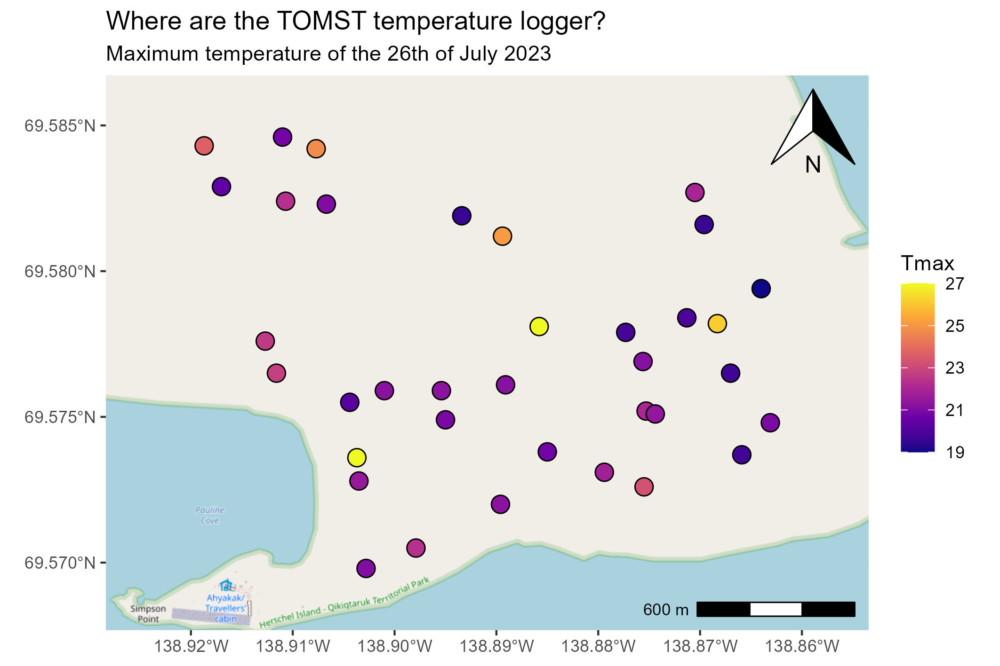

# TOMST-QHI

*This repository stores the raw TOMST logger data collected at the end of each field season on Qikiqtaruk- Herschel Island, Yukon. It also includes the scripts to pre-process the data and sample scripts for how to aggregrate the data for various uses.*

## Description

TOMST are autonomous units which measure air and soil temperature as well as soil moisture using three temperature sensors and one soil moisture sensor. Specifications for the TOMST equipment can be found [here](https://tomst.com/web/en/systems/tms/tms-4/). TOMST01-20 are associated with Phenocams. More details are available in TOMST_metadata.csv

## Data list

The TOMST were initially deployed in July 2022 at 40 sites. TOMST begin collected data from when they are manufactured, so data recorded prior to this date is pre-deployment and should be removed.

Following July 2022, the TOMST have remained deployed in the field and members of Team Shrub download the data from the TOMST each August. Therefore, each 'year' folder doesn't just represent data from that year, but rather the year that the data was downloaded from the TOMST and includes that year's summer field season and all years before it). If a TOMST is lost or damaged before the next download, all data is lost and so previous years downloads are retained to act as a backup. Please see the TOMST Graveyard for details of when TOMST were lost/ damaged and if/when they were replaced.

All data in the "year" folders is stored as raw data from the TOMST. Scripts for pre-processing and data organization are available in the Scripts section below.

*When new raw data is available please add it to an appropriate year folder and ensure it is following the same naming convention as the other folders.*

CSVs in the data folder are prepared data, including: \* 2025_TOMSTdata_preprocessed_daily.csv : 2022-2025 data that has been pre-processed and aggregated to **DAILY** values using *Pre-processing_script_TOMST.R*. Note that max and min are actually the 95th percentile and 5th percentile values. \* 2025_TOMSTdata_preprocessed_monthly.csv : 2022-2025 data that has been pre-processed and aggregated to **MONTHLY** values using *Pre-processing_script_TOMST.R*. Note that max and min are actually the 95th percentile and 5th percentile values. \* TOMST_metadata.csv : Data about the TOMST locations, including lat, long, closest phenocam and more.

### *TOMST Graveyard*

-   In 2023, TOMST_02 (serial#: 94217233) was lost in the ALD at phenology ridge. Therefore the most recent TOMST_02 data is from 2022.
-   On June 13 2024 TOMST_14 (serial#: 94217222) broke. The data up to that date is available in the 2024 folder.
-   In 2025, TOMST_11 (serial#: 94217225) was lost to a retrogressive permafrost thaw slump in summer of 2025. The most recent data is from 2024.

As of 2025, no TOMST have been replaced.

## Scripts

When new raw TOMST data is available it is appropriate to use *Pre-processing_script_TOMST.R* to re-pre-process the data and print new preprocessed files for the most recent year. The *Pre-processing_script_TOMST.R* is clearly annotated such that anyone should be able to understand it.

Once standardized pre-processing is complete, you can clean the data in whichever way makes sense for your project. Example cleaning scripts include:

### Acknowledgments

These data were collected by various members of Team Shrub on Qikiqtaruk- Herschel Island located off the north coast of the Yukon in the Tariuq (Beaufort Sea). Qikiqtaruk lies within the Inuvialuit Settlement Region and is part of Qikiqtaruk Territorial Park, which is co-managed by the Inuvialuit and the Yukon Government. The island holds deep cultural and historical significance for the Inuvialuit and it remains an active and meaningful part of the Inuvialuit homeland. This repo was prepared by Bailey Bingham and Jeremy Borderieux.
